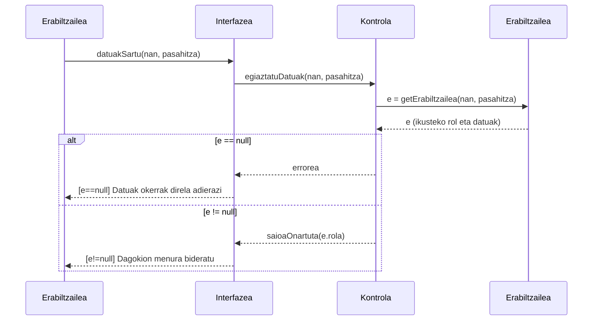

# 1. Saioa Hasi - Sekuentzia Diagrama

Diagrama honek erabiltzaile batek sisteman saioa hastean jarraitzen duen prozesua erakusten du.

## Draw.io-n marrazteko elementuak (Zutabeak):
*   **Aktorea:** Erabiltzailea
*   **Muga / Interfazea:** Interfazea (Login pantaila)
*   **Kontrola:** Kontrola (Saioaren kudeatzailea)
*   **Klasea:** Erabiltzailea (Klasea/Datu-basea)

## Urratsak (Geziak) Draw.io-n irudikatzeko:
1.  **Erabiltzailea -> Interfazea:** Erabiltzaileak bere NAN eta Pasahitza sartu eta "Saioa hasi" botoia sakatzen du. Geziaren testua: `datuakSartu(nan, pasahitza)`
2.  **Interfazea -> Kontrola:** Interfazeak datuak kontrolagailuari bidaltzen dizkio. Gezi testua: `egiaztatuDatuak(nan, pasahitza)`
3.  **Kontrola -> Erabiltzailea (Klasea):** Kontrolak datu-basean/klasean erabiltzailea bilatzen du. Gezi testua: `e = new Erabiltzailea(nan, pasahitza)` edo `e = getErabiltzailea(nan, pasahitza)`
4.  **Erabiltzailea (Klasea) -> Kontrola** (Zatikako lineaz / puntu-puntuzkoa): Bilaketaren emaitza itzultzen du. Testua: `e`

**[Alt: e == null] (karratuan inguratuta Draw.io-n)**:
5.  **Kontrola -> Interfazea** (Zatikako lineaz): Emaitza hutsa bada. Testua: `errorea`
6.  **Interfazea -> Erabiltzailea** (Zatikako lineaz): Errore-mezua pantailan. Testua: `[e==null] Datuak okerrak direla adierazi`

**[Alt: e != null]**:
7.  **Kontrola -> Interfazea** (Zatikako lineaz): Datuak zuzenak dira bere rolarekin batera. Testua: `saioaOnartuta(rol)`
8.  **Interfazea -> Erabiltzailea** (Zatikako lineaz): Dagokion menura sartzeko aukera eman. Testua: `Menura bideratu`

---

## Ikuspegia (Mermaid bidez)
*Hobeto ulertzeko eskema auto-generatua:*

