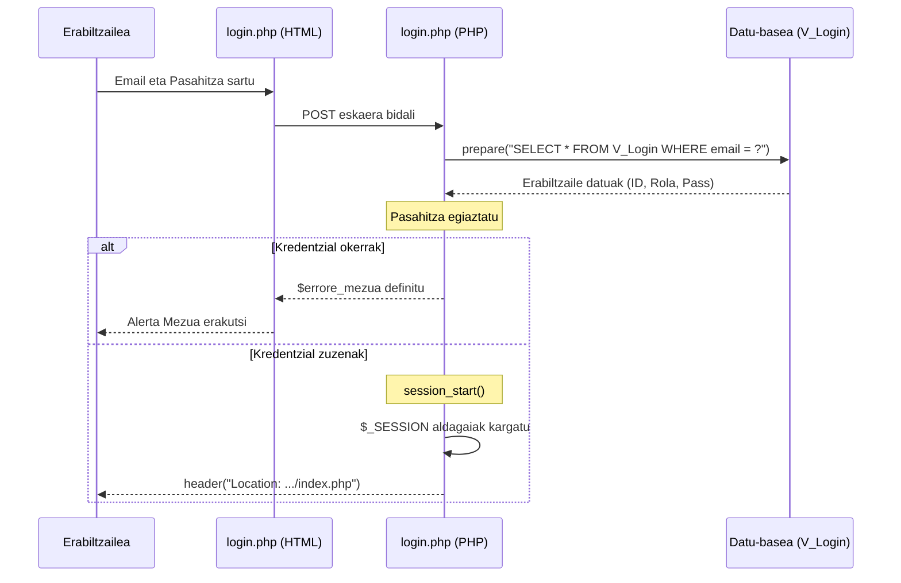

# 1. Saioa Hasi - Sekuentzia Diagrama

Diagrama honek erabiltzaile batek `login.php` bitartez saioa hastean jarraitzen duen prozesu ERREALA erakusten du.

## Partaideak (Zutabeak):
*   **Erabiltzailea:** Sisteman sartu nahi duen pertsona.
*   **login.php (HTML):** Erabiltzaileari erakusten zaion inprimakia.
*   **login.php (PHP):** Zerbitzarian exekutatzen den backend logika.
*   **Datu-basea (V_Login):** Erabiltzaileen datuak gordetzen dituen bistak.

## Urratsak (Gertaerak):
1.  **Erabiltzailea -> login.php (HTML):** Emaila eta pasahitza idatzi eta "Sartu" sakatu.
2.  **login.php (HTML) -> login.php (PHP):** Formularioa bidali `POST` metodoaren bidez.
3.  **login.php (PHP) -> Datu-basea:** Kredentzialak egiaztatu. Testua: `SELECT * FROM V_Login WHERE email = ?`
4.  **Datu-basea -->> login.php (PHP):** Erabiltzailearen errenkada (id, pasahitza, rola).
5.  **login.php (PHP) -> login.php (PHP):** Pasahitza konparatu (`$pasahitza === $user['pasahitza']`).

**[Alt: Kredentzial okerrak edota erabiltzailea ez dago aktibo]**:
6.  **login.php (PHP) -->> login.php (HTML):** Errore mezua definitu (`$errore_mezua`).
7.  **login.php (HTML) -->> Erabiltzailea:** Alerta gorria erakutsi pantailan.

**[Alt: Kredentzial zuzenak]**:
8.  **login.php (PHP) -> login.php (PHP):** Saioa hasi eta aldagaiak gorde. Testua: `session_start()` eta `$_SESSION['rol_id'] = ...`
9.  **login.php (PHP) -->> Erabiltzailea:** Orri nagusira birbideratu. Testua: `header("Location: ../php_osasun_langileak/index.php")` (edota dagokion rola).

---

## Ikuspegia (Mermaid)

