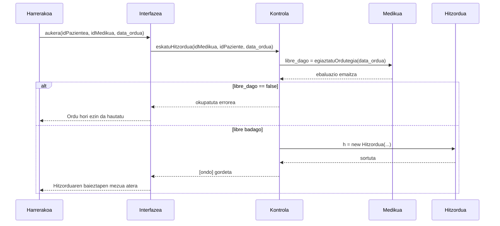

# 3. Hitzordua Hartu - Sekuentzia Diagrama

Harrerako langileak paziente baten izenean hitzordu berri bat mediku espezifiko batekin gorde nahi duenean garatzen den fluxua.

## Draw.io-n marrazteko elementuak (Zutabeak):
*   **Aktorea:** Harrerakoa
*   **Muga / Interfazea:** Interfazea (Egutegia eta orduen taula)
*   **Kontrola:** Kontrola (Hitzorduen kudeatzailea)
*   **Klasea 1:** Medikua (Ordutegia egiaztatzeko)
*   **Klasea 2:** Hitzordua (Klasea / instantzia berria)

## Urratsak (Geziak) Draw.io-n irudikatzeko:
1.  **Harrerakoa -> Interfazea:** Pazientea eta Medikua aukeratu eta egun/ordu zehatz batean klikatzean. Testua: `aukera(idPazientea, idMedikua, data_ordua)`
2.  **Interfazea -> Kontrola:** Eskaria kontrolera doan lekua. Testua: `eskatuHitzordua(idMedikua, idPaziente, data_ordua)`
3.  **Kontrola -> Medikua (Klasea):** Kontrolak ea ordutegi horretan librea baden medikua bilatzen du. Testua: `orduBerdinaDauka = egiaztatuOrdutegia(idMedikua, data_ordua)`
4.  **Medikua (Klasea) -> Kontrola** (Zatikako): Erantzuna jaso. Testua: `bai / ez`

**[Alt: Medikuak ordutegia okupatuta badu ordu horretan]**:
5.  **Kontrola -> Interfazea** (Zatikako): `errorea`
6.  **Interfazea -> Harrerakoa** (Zatikako): `[okupatua] Ordu hori jada hartuta dagoela adierazi`

**[Alt: Ordu librea badago]**:
7.  **Kontrola -> Hitzordua (Klasea):** Kontrolak instantzia sortzen du. Testua: `h = new Hitzordua(idMedikua, idPaziente, data_ordua)`
8.  **Hitzordua -> Kontrola** (Zatikako): `sortuta`
9.  **Kontrola -> Interfazea** (Zatikako): `baieztapena`
10. **Interfazea -> Harrerakoa** (Zatikako): `Hitzordua ongi gorde dela erakutsi eta egutegian agertu`

---

## Ikuspegia (Mermaid bidez)

