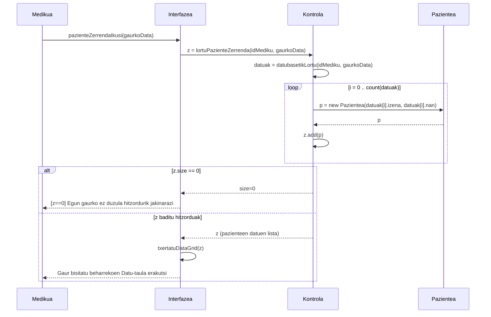

# 5. Paziente Zerrenda Ikusi - Sekuentzia Diagrama

Medikuak saioa hasita duela, bere eguneko pazienteen zerrenda edo bere kargura dauden paziente guztiak kontsultatzen dituen prozesua bada.

## Draw.io-n marrazteko elementuak (Zutabeak):
*   **Aktorea:** Medikua
*   **Muga / Interfazea:** Interfazea (Paziente zerrendaren bistaratzailea)
*   **Kontrola:** Kontrola (Medikuaren hitzorduen kontrolatzailea)
*   **Klasea:** Pazientea / Hitzordua (Bilaketa egin ahal izateko)

## Urratsak (Geziak) Draw.io-n irudikatzeko:
1.  **Medikua -> Interfazea:** Medikuak "Pazienteak ikusi" atalera klik egiten du. Testua: `pazienteZerrendaIkusi(gaurkoData)`
2.  **Interfazea -> Kontrola:** Eskaeraren datuak bidaltzen dizkio. Testua: `lortuPazienteZerrenda(idMedikua, gaurkoData)`
3.  **Kontrola -> Kontrola:** DB edo bestelako informazio-iturri batetik pazienteen datu gordinak eskuratzen ditu. Testua: `datuak = datubasetikLortu(idMedikua, gaurkoData)`

**Begizta (Loop) [i = 0 .. count(datuak)]:**
4.  **Kontrola -> Pazientea (Klasea):** Datu horiekin Paziente objektua sortzen du banan-banan. Testua: `p = new Pazientea(datuak[i].izena, datuak[i].nan)`
5.  **Pazientea -> Kontrola** (Zatikakoa): Instantzia itzultzen da. Testua: `p`
6.  **Kontrola -> Kontrola:** Instantzia hori Array/Zerrenda batean (z) gehitzen da. Testua: `z.add(p)`

**[Alt: z == null edo luzera = 0 (Gaur egun ez dauka pazienterik)]**
7.  **Kontrola -> Interfazea** (Zatikakoa): Emaitza hutsik dagoela bueltatzen du. Testua: `z.size = 0`
8.  **Interfazea -> Medikua** (Zatikakoa): `[z==0] Adierazi pantailan ez daukala inor programatua.`

**[Alt: Zerrenda ekarri badu (luzera > 0)] [else]**
9.  **Kontrola -> Interfazea** (Zatikakoa): Sortutako pazienteen lista bueltatzen du. Testua: `z` (Paziente zerrenda)
10. **Interfazea -> Interfazea:** Pantailako grid-a eguneratzen da. Testua: `txertatuTaula(z)`
11. **Interfazea -> Medikua** (Zatikakoa): `Taula eta gaurko zerrendaren xehetasunak erakutsi pantailan.`

---

## Ikuspegia (Mermaid bidez)

